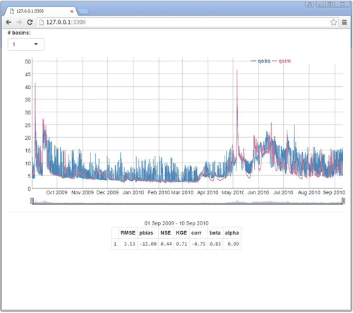

```{r setup, include=FALSE, purl=FALSE}
  knitr::opts_chunk$set(eval = FALSE, tidy = FALSE)
```

# Introduction
This section defines the code of a [shiny app](http://shiny.rstudio.com/)
that lets users explore the (hydro-) graphs for the different basins in
conjunction with a objective functions for the user-selected time-window. The
calculation of the objective functions is independent of the code defined in
the section about `computing_of`, since simpler constructions are preferable
in the case at hand and more information is give to the user.

The computations of the app are defined in the `server` part and the
appearance in the `ui`. The app itself is depicted in the following figure:



User can select different basins via the selection box (*# basins:*) on the
top-left and interactively zoom and move the graph in the center by clicking
on it or moving the date switches below the graph. While doing so the
objective functions (presented in the table below) are re-calculated for the
chosen time window.

# Code
In the following paragraphs the code of the shiny app is defined.

## `explore_basins_with_of`
This function represents the main part of the shiny app. The Rd-help is
defined as following:
```{r}
  #' explore runoff_data with Objective Functions
  #'
  #' Runs a Shiny App which can be used to get an overview of a runoff_data time
  #' series object.
  #'
  #' @param d_xts runoff_data formatted as time series
  #' @export
  #' @examples
  #' # get example data,
  #' # clean it and
  #' # explore the model performance
  #' d_runoff <- get_runoff_example()
  #' explore_runoff_with_ofun(d_runoff)
```

The app has actually quite a lot of dependencies. Right now these are:
```{r}
explore_runoff_with_ofun <- function(runoff_data) {
  require("shiny", quietly = TRUE)
  require("dplyr", quietly = TRUE) # supreme `selection` and the `filtering`
  require("magrittr", quietly = TRUE) # pipe operator
  require("xts", quietly = TRUE) # required for dygraphs
  require("dygraphs", quietly = TRUE) # interactive plotting
  ##########################
```

Currently the shiny app needs some pre-calculation, which are send with `<<-`
to the global environment. This is actually bad, since the function changes the
variables of the global environment. But until now, no better solution could be
found. The first part (I) of the pre-calculations includes the defensive
function `remove_leading_zeros`, that removes the leading zeros from the
data.frame `runoff_data`.
For example: If a column would be named `QOBS_00001` it would be transformed to
`QOBS_1`. Afterwards, it is checked if the "cleansed" data (`clean_runoff_data`)
does the needed `viscos_options("name_COSposix")` column. If it does not, then
the column is created with `prepare_complete_date`. In the second part (II)
the actual pre-calculation takes place. The data is transformed into an `xts`
object (`d_xts`).

Then columns with $x$ and $y$ data are marked and the internal numeration is
saved within the variable `d_nums`. The former operation is achieved by
searching for all the columns with digits in `d_xts`. The latter by removing
all the non-digits from the column-names and searching for the unique integer.

Note that this approach forces users to enumerate their basins with integers,
as floating-numbers would be transformed to!
```{r}
  #$ this is all suboptimal!
  # (I)
  clean_runoff_data <- runoff_data %>% remove_leading_zeros
  if ( !viscos_options("name_COSposix") %in% names(clean_runoff_data) ) {
    clean_runoff_data %<>% prepare_complete_date
  }
  # (II)
    d_xts <- runoff_as_xts(clean_runoff_data)
    idx_names <- names(d_xts) %>%
      grepl("\\d" ,.)
    d_nums <- d_xts %>%
      names() %>%
      .[idx_names] %>%
      gsub("\\D","",.) %>%
      as.integer %>%
      unique
```

The server-side of the shiny app is rather lengthy but not to difficult.
The major readability problems occur because of the unusual formatting enforced
by shiny. The `reactive({})` marks all the interactive parts of the server.
The calculations are saved in the output-structures, which is handed over to the
`ui`. The graphs are saved/plotted to `output$hydrographs` and the objective
functions to `output$slctd_OF`. The start and end of the current time window is
haned  as string to the variable `output$selected_timewindow`. This requires
some transformation from the obtained `xts` values. This is done with
`strftime(., format = "%d %b %Y)`, which converts between character
representations and objects of `POSIXlt` and `POSIXct`.
```{r}
  server <- function(input, output, session) {# executes calculation file
    # get strings used in the naming of clean_runoff_data
    unique_data_names <- names(clean_runoff_data) %>%
      gsub("\\d","",.) %>%
      tolower %>%
      unique
    x_string <- unique_data_names[ unique_data_names %>%
                                     grep(viscos_options("name_data1"),.) ]
    y_string <- unique_data_names[ unique_data_names  %>%
                                     grep(viscos_options("name_data2"),.) ]
    # (II) select data
    '%&%' <- function(a,b) paste(a,b,sep = "")
    selector_x <- reactive({ x_string %&% input$basin_num %&% "$" })
    selector_y <- reactive({ y_string %&% input$basin_num %&% "$" })
    selected_data <- reactive({
      select(clean_runoff_data,
             matches( selector_x() ),
             matches( selector_y() )
      ) %>%
        select(x = matches( selector_x() ),
               y = matches( selector_y() ))
    })
    # create xts-formated table for use in dygraphs
    xts_selected_data <- reactive ({
      xts(selected_data(),
          order.by = clean_runoff_data[[viscos_options()$name_COSposix]])
    })
    # plots
    output$hydrographs <- renderDygraph({
      dygraph(xts_selected_data(), group="A") %>%
        dySeries("x",
                 label = visCOS::viscos_options()$name_data1,
                 color = viscos_options()$color_data1 ) %>%
        dySeries("y",
                 label = visCOS::viscos_options()$name_data2,
                 color = viscos_options()$color_data2 ) %>%
        dyOptions(includeZero = TRUE) %>%
        dyRangeSelector(height = 20, strokeColor = "")
    })
    # beginnning and end of time window
    selcted_from <- reactive({
      if (!is.null(input$hydrographs_date_window))
        input$hydrographs_date_window[[1]]
    })
    selcted_to <- reactive({
      if (!is.null(input$hydrographs_date_window))
        input$hydrographs_date_window[[2]]
    })
    # stats header
    output$selected_timewindow <- renderText({
      if (!is.null(input$hydrographs_date_window))
        paste(strftime(selcted_from(), format = "%d %b %Y"),
              "-",
              strftime(selcted_to(), format = "%d %b %Y"),
              sep = " ")
    })
    # stats calc
    sub_slctd <- reactive({
      if (!is.null(input$hydrographs_date_window))
        xts_selected_data()[paste(strftime(selcted_from(), format = "%Y-%m-%d-%H-%M"),
                               strftime(selcted_to(), format = "%Y-%m-%d-%H-%M"),
                               sep = "/")]
    })
    output$slctd_OF <- renderTable({
      if (!is.null(input$hydrographs_date_window))
        out <- serve_ofun( sub_slctd()$x,sub_slctd()$y )
    })
  }
```

The `ui` is quite spartan. It consists a input selection (`selectInput`),
which allows user to select different basins, the `dygraph` output `hydrographs`
for the interactive exploration of the $x$ and $y$ data and a formatted table
output (`slctd_OF`), which displays the different objective functions (defined
in `explore_ofun`). The `hr` command block separates this table from the
`dygraph` output via a small-grey line.
```{r}
  ui <- fluidPage(
      selectInput("basin_num",
                  "# basins:",
                  choices = d_nums,
                  selected = 1,
                  width = "100px"),
      dygraphOutput("hydrographs", width = "100%", height = "400px"),
      hr(),
      fluidRow(
        column(12, align = "center",
          textOutput("selected_timewindow"),
          tableOutput("slctd_OF")
        )
      )
    )
```

```{r}
  shinyApp(ui,server)
}
```


### `explore_ofun`
This function is a sub-function of `explore_basins_with_of` and basically simpler
version of `extract_objective_functions`. `explore_ofun` is not exported and
envisioned to be used within the shiny app.
It takes the two variables $x$ and $y$ (as used within this section)
and calculates the root mean squared error $RMSE = \sqrt{\sum(x(t)-y(t))^2}$
and the objective functions used within **visCOS** (see: introduction).
It also returns the $\alpha$ and $\beta$ of the $KGE$.
The former is the relation of the standard deviations and therefore a measure
of the of relative variability in the $y$ and $x$ values. The latter represents
the bias as a ratio of the two mean values of $x$ and $y$.

Including $\alpha$ and $\beta$ is supposed to enable users to get a bit more
intuition about the how the $KGE$ works. Personal experience suggests however
that the $KGE$ is difficult to grasp!
```{r}
serve_ofun <- function(x,y) {
  require("hydroGOF", quietly = TRUE)
  require("magrittr", quietly = TRUE)
  # compute objective functions
  out <- data.frame(
    RMSE = rmse(y,x) %>% as.numeric,
    pbias = pbias(y,x) %>% as.numeric,
    NSE = NSE(y,x) %>% as.numeric,
    KGE = KGE(y,x) %>% as.numeric,
    corr = -cor(x,y) %>% diag(),
    beta =  mean(y)/mean(x),
    alpha =  sd(y)/sd(x)
  )
  return(out)
}
```
