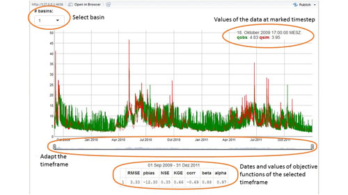
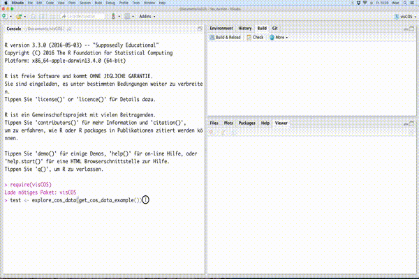

# Exploring Objective Functions

```{r setup3, include=FALSE, purl=FALSE}
  knitr::opts_chunk$set(eval = FALSE, tidy = FALSE)
```

This section defines the code of a [shiny gadget](http://shiny.rstudio.com/).
It enables the interactive exploration of (hydro-) graphs for the different basins.
The gadget shows always the corresponding objective function for the selected
graph. Furthermore, one can get the selected data by clicking on "done" at the
end of a session. The following examples provide a good overview of what the
function can do.

## Example
This chapter gives examples of `of_explore`. For the pre-requirements take
a look at the [introduction](LP-Introduction).
Running the `of_explore` function without any options opens a shiny gadget
in the viewer:

```{r, eval=TRUE, echo=FALSE}
if (knitr:::is_latex_output()) {
  
} else {
  
}
```

Information on the *objective functions* can be found
[here](ex-OF_explanation.html).
```{r,purl=FALSE, eval = FALSE}
viscos_options(color_o = "green", color_s = "red")
of_explore(runoff_example)
```

Users can select different basins via the selection box (*# basins:*) on the
top-left and interactively zoom and move the graph in the center by clicking
on it or moving the date switches below the graph. While doing so the
objective functions (presented in the table below) are re-calculated for the
chosen time window.


## Code
In the following paragraphs the code of the shiny app is defined.
The computations of the app are defined in the `server` part and the
appearance in the `ui`.

### Objective Function Objectivation
This function represents the main part of the shiny app.
The current solution **forces** users to enumerate their basins with and the 
shiny app needs some pre-calculation, which need to be calculated before the app 
is started. These calculations are made before the app as such is defined.
They include:

- (I) Defensive ocde
- (II) Transformation of data into `xts` (`d_xts`).
- (III) Save numeration of basins within the variable `d_nums`.
```{r}
  # --------------------------------------------------------------------------
  #' Explore with Objective Functions
  #'
  #' Runs a Shiny Gadget which can be used to get an overview of a cos_data time
  #' series object.
  #'
  #' @param d_xts cos_data formatted as time series
  #'
  #' @import shiny
  #' @import miniUI
  #' @importFrom xts xts
  #' @import dplyr
  #' @import magrittr
  #' @import dygraphs
  #' @import hydroGOF
  #' @import pasta
  #' @importFrom purrr map_df
  #'
  #' @export
  #'
  #' @examples
  #' # get example data,
  #' # explore the model performance
  #' cos_data <- get_viscos_example()
  #' of_explore(cos_data)
of_explore <- function(cos_data,
                             of_list = list(
                               nse = of_nse,
                               kge = of_kge,
                               p_bias = of_p_bias,
                               r = of_cor
                               ),
                             start_date = NULL,
                             end_date = NULL) {
  # (I) pre-sets: ============================================================
  if (is.null(names(of_list))){
    names(of_list) <- paste("of", 1:length(of_list), sep = "_")
  }
  clean_cos_data <- cos_data %>% remove_leading_zeros
  if ( !viscos_options("name_COSposix") %in% names(clean_cos_data) ) {
    clean_cos_data %<>% complete_dates
  }
  names_data <- names(clean_cos_data) %>% tolower(.)
  number_lb <- grepl(viscos_options("name_lb"), 
                     names_data, 
                     ignore.case = TRUE) %>% sum(.)
  number_ub <- grepl(viscos_options("name_ub"), 
                     names_data, 
                     ignore.case = TRUE) %>% sum(.)
  plot_bounds <- FALSE 
  if( (number_lb > 0) & (number_ub > 0)) {
    number_obs <- grepl(viscos_options("name_o"), 
                        names_data, 
                        ignore.case = TRUE) %>%sum(.)
    number_sim <- grepl(viscos_options("name_s"), 
                        names_data, 
                        ignore.case = TRUE) %>% sum(.)
    if (number_lb != number_ub) {
      stop("number of available bounds is not the same!" %&&% 
             "#lb=" %&% number_lb %&&% 
             "#ub=" %&% number_ub)
    } else if ((number_lb != number_obs) | (number_lb != number_sim)) {
      stop("Number of bounds is not the same as the o/s data!" %&&%
            "#bounds=" %&% number_lb %&&% 
             "#obs=" %&% number_obs %&&%
             "#sim=" %&% number_sim)
    } else {
      plot_bounds <- TRUE # switch: plot bounds
    }
  }
  # (II) =====================================================================
  d_xts <- cos_data_as_xts(clean_cos_data)
  # (III) ====================================================================
  idx_names <- grepl(viscos_options("name_o"), 
                     names_data, 
                     ignore.case = TRUE)
  d_nums <- names_data %>%
      .[idx_names] %>%
      gsub("\\D","",.) %>%
      as.integer(.) %>%
      unique(.)
  # (V) Define App: =========================================================
  server <- function(input, output, session) {
    # (a) get needed strings: ###############################################
    unique_data_names <- gsub("\\d","",names_data) %>%
      unique(.)
    x_string <- unique_data_names[ grep(viscos_options("name_o"),
                                        unique_data_names) ]
    y_string <- unique_data_names[ grep(viscos_options("name_s"),
                                        unique_data_names) ]
    if (plot_bounds) {
      lb_string <-  unique_data_names[ grep(viscos_options("name_lb"),
                                            unique_data_names) ]
      ub_string <-  unique_data_names[ grep(viscos_options("name_ub"),
                                            unique_data_names) ]
    }
    # (b) select data:
    # note: the regular expressions "$" terminates the searchstring
    selector_x <- reactive({ x_string %&% input$basin_num %&% "$" }) 
    selector_y <- reactive({ y_string %&% input$basin_num %&% "$" })
    selector_lb <- reactive({ 
      if(plot_bounds){
        lb_string %&% input$basin_num %&% "$" 
      } else {
        NA
      }
    })
    selector_ub <- reactive({ 
      if(plot_bounds){
        ub_string %&% input$basin_num %&% "$"
      } else {
        NA
      }
    })
    selected_data <- reactive({
      if(plot_bounds) {
        clean_cos_data %>% 
          select(matches( selector_x() ),
                 matches( selector_y() ),
                 matches( selector_lb() ),
                 matches( selector_ub() )
                 ) %>% 
          select(x = matches( selector_x() ),
                 y = matches( selector_y() ), 
                 lb = matches( selector_lb() ),
                 ub = matches( selector_ub() ))
      } else {
        clean_cos_data %>% 
          select(matches( selector_x() ),
                 matches( selector_y() )
                 ) %>% 
          select(x = matches( selector_x() ),
                 y = matches( selector_y() ))
      }
    })
    # (c) create xts-formated table for use in dygraphs:
    xts_selected_data <- reactive ({
      xts(selected_data(),
          order.by = clean_cos_data[[viscos_options("name_COSposix")]])
    })
    # (d) create plots:
    base_graph <- reactive({
      if(plot_bounds) {
        dygraph( xts_selected_data() ) %>%
        dyAxis("y",
               label = visCOS::viscos_options("data_unit")) %>%
        dySeries("x",
                 label = visCOS::viscos_options("name_o"),
                 color = viscos_options("color_o")) %>%
        dySeries("y",
                 label = visCOS::viscos_options("name_s"),
                 color = viscos_options("color_s")) %>%
        dySeries("lb", 
                 label = visCOS::viscos_options("name_lb"),
                 color = "grey80") %>% 
        dySeries("ub", 
                 label = visCOS::viscos_options("name_ub"),
                 color = "grey80")
      } else {
        dygraph( xts_selected_data() ) %>%
        dyAxis("y",
               label = visCOS::viscos_options("data_unit")) %>%
        dySeries("x",
                 label = visCOS::viscos_options("name_o"),
                 color = viscos_options("color_o")) %>%
        dySeries("y",
                 label = visCOS::viscos_options("name_s"),
                 color = viscos_options("color_s"))
      }
    })
    output$hydrographs <- renderDygraph({
      base_graph() %>%
        dyRangeSelector(height = 20, strokeColor = "") %>%
        dyCrosshair(direction = "vertical") %>%
        dyOptions(includeZero = TRUE,
                  retainDateWindow = TRUE,
                  animatedZooms = TRUE)
    })
    # (e) get dygraph date bounds (switches):
    selcted_from <- reactive({
      if (!is.null(start_date)) {
        start_date
      } else if (!is.null(input$hydrographs_date_window)) {
        input$hydrographs_date_window[[1]]
      }
    })
    selcted_to <- reactive({
      if (!is.null(end_date)) {
        end_date
      } else if (!is.null(input$hydrographs_date_window)) {
        input$hydrographs_date_window[[2]]
      }

    })
    # (f) extract time_window for the stats header:
    output$selected_timewindow <- renderText({
      if (!is.null(input$hydrographs_date_window))
        paste(strftime(selcted_from(), format = "%d %b %Y"),
              "-",
              strftime(selcted_to(), format = "%d %b %Y"),
              sep = " ")
    })
    # (g) calculate stats:
    sub_slctd <- reactive({
      if (!is.null(input$hydrographs_date_window))
        xts_selected_data()[paste(strftime(selcted_from(), format = "%Y-%m-%d-%H-%M"),
                               strftime(selcted_to(), format = "%Y-%m-%d-%H-%M"),
                               sep = "/")]
    })
    out_of <- reactive({
      if (!is.null(input$hydrographs_date_window)) {
          map_df(of_list, function(of_,x,y) of_(x,y),
                 x = sub_slctd()$x,
                 y = sub_slctd()$y ) #serve_of( sub_slctd()$x,sub_slctd()$y )
      }
    })

    output$slctd_OF <- renderTable(out_of())
    # (h) exit when user clicks on done
     # When the Done button is clicked, return a value
    observeEvent(input$done, {
      returnValue <- list(
        selected_time = c(strftime(selcted_from(), format = "%Y-%m-%d-%H-%M"),strftime(selcted_to(), format = "%Y-%m-%d-%H-%M")),
        selected_data = data.frame(date = index(sub_slctd()),
                                   coredata(sub_slctd())),
        selected_of = out_of()
      )
      stopApp(returnValue)
    })
  }
```

The `miniUI` is quite spartan. There is an `miniButtonBlock` that allows to select different basin, as as the `dygraph` output (i.e `hydrographs`)
for the interactive exploration of the $o$ and $s$ data. The formatted table (`slctd_OF`) displays the different objective functions, that can be given to `of_explore` .
```{r}
  ui <- miniPage(
    miniButtonBlock(selectInput("basin_num",
                                "# basin:",
                                choices = d_nums,
                                selected = 1,
                                selectize = FALSE)),
    miniContentPanel(
      fillCol(
        flex = c(4,1),
        dygraphOutput("hydrographs", width = "100%", height = "100%"),
        fillCol(
          align = "center",
          textOutput("selected_timewindow"),
          tableOutput("slctd_OF")
        )
      )
    ),
    gadgetTitleBar("test")
  )
```

```{r}
dyCrosshair <- function(dygraph,
                        direction = c("both", "horizontal", "vertical")) {
  dyPlugin(
    dygraph = dygraph,
    name = "Crosshair",
    path = system.file("plugins/crosshair.js",
                       package = "dygraphs"),
    options = list(direction = match.arg(direction))
  )
}
```


```{r}
  runGadget(ui,server)
}
```
