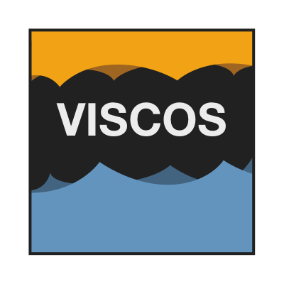

# The Guide

```{r, fig.align = 'center', out.width = '50%', echo = FALSE}
  
```

This is the guide and definition of **visCOS**.

visCOS stands for "visual comparison of observations and simulations".
The package is still changing quite often. We therefore recommend to not use it
yet.  

---

## Introduction

```{r setup1, include=FALSE, purl=FALSE}
 knitr::opts_chunk$set(eval = FALSE, tidy = FALSE, fig.align = 'center')
```

This guide defines the code for the R-package visCOS and provides instructions,
examples and tips for using it.

The goal of visCOS is to provide a possibility to streamline the R based
visual-analysis for the hydrological model COSERO. COSERO is a HBV-like
distributed rainfall-runoff model, developed at the institute for water
management, hydrology and hydraulic engineering at BOKU, Vienna. The name is an
abbreviation for "Conceptual Semi-Distributed Rainfall Runoff Model".

visCOS is embedded into a broader effort that aims to establish practical and
easy-to-use workflows between R and COSERO. The overall concept of that project
is shown in **Figure xyz**. The R-package `coscos` provides the backbone
of the projects. It provides the basic interface between COSERO and R, generic
helper functions and primitives, and defines the options for all subsequent
package. Currently, visCOS is the only package that builds on it, but hopefully    
soon we will have more packages, ideas and scripts that are able to use it. s

**Figure xyz**

## visCOS and other R-package
There exist many R-packages dedicated to hydrology.

Among then, several have provide help to the calibration of (conceptual)
rainfall-runoff models. As their name suggests, these models relate the a
rainfall input to a generated runoff for some given basins They have found
a wide array of applications in hydrology. Form the analysis of catchment
properties to climate impact studies, so to speak. From the point o view of the
R package ecosystem there are to packages, which are of particular interest with
regard to **visCOS**:
The [`hydroGOF`](https://CRAN.R-project.org/package=hydroGOF) package and the
[`hydroTSM`](https://CRAN.R-project.org/package=hydroTSM) package. The former
provides the most commonly used (and discussed) objective functions. The
latter, helps with the analysis, interpolation and the plotting of hydrological
time series.

As an R-package that aim of **visCOS** is to provide visual aids for
the parameter estimation process of multiple (related) basins or catchments.

Thus, topic wise, visCOS can be positioned somewhere in-between the two
previously mentioned packages. visCOS is usable for conceptual rainfall
runoff models in general, but almost all of its functionality has been derived
from different applications of the COSERO model.
