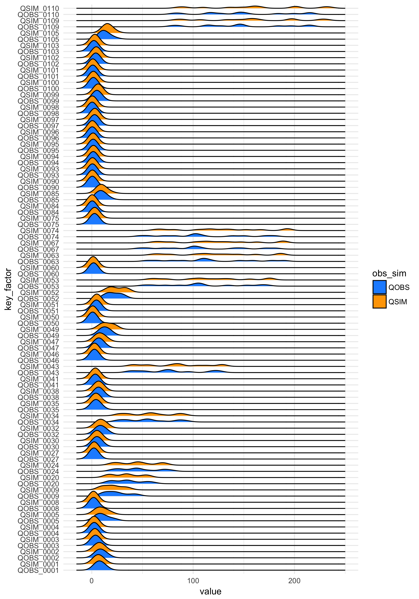

# Hello Traveler {-}

```{r, fig.align = 'center', out.width = '50%', echo = FALSE}
  knitr::include_graphics("figures/icon_viscos.png")
```

This is documentation and code for the R-package **visCOS**. **visCOS** stands
for  *vis*ual *c*omparison of *o*bservations and *s*imulations. The package is
still under (heavy) development and we therefore do not recommended to use the package, yet.

---

There exist many R-packages dedicated to hydrology.

Among then, several have provide help to the calibration of (conceptual)
rainfall-runoff models. As their name suggests, these models relate the a
rainfall input to a generated runoff for some given basins They have found
a wide array of applications in hydrology. Form the analysis of catchment
properties to climate impact studies, so to speak. From the point o view of the
R package ecosystem there are to packages, which are of particular interest with
regard to **visCOS**:
The [`hydroGOF`](https://CRAN.R-project.org/package=hydroGOF) package and the
[`hydroTSM`](https://CRAN.R-project.org/package=hydroTSM) package. The former
provides the most commonly used (and discussed) objective functions. The
latter, helps with the analysis, interpolation and the plotting of hydrological
time series.

As an R-package that aim of **visCOS** is to provide summaries - in a visual
and numerical sense - to aid a concurrent and comparative parameter estimation
for multiple (related) basins or catchments. Topic wise, **visCOS** might
therefore be positioned somewhere in-between the two previously mentioned
packages. **visCOS** is usable for conceptual rainfall runoff models
in general, but almost all of its functionality has been derived from different
applications of the COSERO model. COSERO is a HBV-like distributed
rainfall-runoff model, developed at the institute for water management,
hydrology and hydraulic engineering at BOKU, Vienna. The name is an abbreviation
for "**Co**nceptual **Se**mi-Distributed **R**ainfall Run**o**ff Model".

<!--chapter:end:index.Rmd-->

# Introduction

Within **visCOS** "cooking data" is is used as a synonym for the process of
transforming *raw data* into *cooked data*. This process and definitions are,
of course, metaphors. We shall explain them in the following.

## Raw Data
Raw-data is data which is not yet in the right format for its use. Raw-data
takes on many forms. The ones of interest for **visCOS** are series of
observations, $o$, and model simulations, $s$. in the scientific context, raw
data is usually served in some simple file format, e.g. *.txt* or *.csv*. In
other context more complex formats can be found, but we shall not delve into
that now. `R` includes method to read simple formats, e.g. with the different
`read.table` functions (simply enter `?read.table` in your `R` terminal to
get an overview). However, for larger (unstructured) files we recommend the read
functionality of the `data.table` package. In our tests it was fastest and most
flexible choice. Lastly, we recommend `readr` package for well structured and
large data that has to be read.

## Cooked Data
Cooked data is data that is formatted in a way, that can be used be used by
applications. A nice example (or dish if you want to) for cooked data is  
[tidy-data](ftp://cran.r-project.org/pub/R/web/packages/tidyr/vignettes/tidy-data.html).
 Another one might be the storage of data in matrices and vectors. Within
the **visCOS** package, cooked data, is data which is in the *cos_data* format.
This format is a slightly redundant but flexible representation of hydrological
time-series that is derived from the way COSERO produces outputs. All data in
*cos_data* format can be used for further exploratory analysis with the package.

...

Currently **visCOS** only allows to compare between *numbered catchments*! The
data **must** include an integer number at the end of its name, e.g.
`QObs_001` and `QSim_001`).

<!--chapter:end:introduction.Rmd-->

# Read in Data 

Before working in `R` you need to get the data into it. Here we discuss 
differnt optionsfor doing so. 

```{r readin, include=FALSE}
  knitr::opts_chunk$set( fig.align = 'center')
```

```{r} 
  library(magrittr)
```


Simons stuff. Maybe be useful in the future:
```{r}
  # qobs_qsim von COSERO lesen und als getrennte Zeitreihen in einer Liste zurückgeben
  read.qobsqsim <- function(x){
    library(xts)
    output <- list()
    out <- read.table(x,nrow=1,header=TRUE)
    nc <- ncol(out)
    out <- read.table(x,header=TRUE,colClasses=
                        c(rep("character",5),rep("numeric",nc-5)))
    datum <- as.POSIXct(paste(out[,1],out[,2],out[,3],out[,4],out[,5],sep=" "),
                        format="%Y %m %d %H %M",tz="utc")
    out <- xts(out[,6:nc],order.by=datum)
    
    output$QOBS <- out[ ,grep("Qobs",colnames(out))]
    output$QSIM <- out[ ,grep("Qsim",colnames(out))]
    
    return(output)
  }
  
  read.xts <- function(x,datecolums=c(1:5),format="%Y %m %d %H %M",header=TRUE,...){
    library(xts)
    temp <- read.table(x,nrow=1,header=header,...)
    nc <- ncol(temp)
    temp <- read.table(x,colClasses=c(rep("character",max(datecolums)),
                                      rep("numeric",nc-max(datecolums))),
                       header=header,...)
    for(k in datecolums){
      if(k == datecolums[1]){
        datum <- temp[,k]
      } else {
        datum <- paste(datum,temp[,k],sep=" ")
      }
    }
    datum <- as.POSIXct(datum, format=format,tz="utc")
    output <- xts(temp[,(max(datecolums)+1):nc], order.by=datum)
    return(output)
  }
```


<!--chapter:end:LT-readin.Rmd-->

# Aggregate according to time

```{r setup10, include=FALSE, purl=FALSE}
  knitr::opts_chunk$set(eval = FALSE, tidy = FALSE, fig.align = 'center')
```

In hydrology it is often useful to summarise the data respect to a
given time dimension. In **visCOS** this can be done by using the
`aggregate_time` function. The function takes
[COSERO data.frame](cook_data.html) and aggregates them according to a chosen
time dimension. Note, that the name of the dimension can be specified via the
[options](LP-viscos_options.html).

```{r, eval = TRUE, purl=FALSE}
  coscos::libraries(visCOS, ggplot2, dplyr, magrittr)
```

Daily runoff aggregation:
```{r, eval = TRUE, purl=FALSE}
  cosdata <- coscos::viscos_example()
  runoff_aggregate_dd <- aggregate_time(cosdata, "dd") %>% 
    dplyr::mutate(obs_sim = substr(key,1,4), 
                  basin = substr(key,6,9) %>% as.integer(.))
  # plot data:
  ggplot(runoff_aggregate_dd) +
      geom_line(aes(x = dd, y = value, col = obs_sim)) +
      scale_colour_manual(values = c(viscos_options("color_o"),
                                     viscos_options("color_s"))) +
      facet_wrap( ~ basin,ncol = 1) +
      theme_minimal()
```

Monthly runoff aggregation:
```{r, eval = TRUE, purl=FALSE}
  runoff_aggregate_mm <- aggregate_time(cosdata, "mm") %>% 
    dplyr::mutate(obs_sim = substr(key,1,4), 
                  basin = substr(key,6,9) %>% as.integer(.))
  # plot data:
  ggplot(runoff_aggregate_mm) +
      geom_line(aes(x = mm, y = value, col = obs_sim)) +
      scale_colour_manual(values = c(viscos_options("color_o"),
                                     viscos_options("color_s"))) +
      scale_x_discrete(limits = runoff_aggregate_mm$mm) +
      facet_wrap( ~ basin) +
      theme_minimal()
```

Yearly runoff aggregation:
```{r, eval = TRUE, purl=FALSE}
  runoff_aggregate_yyyy <- aggregate_time(cosdata, "yyyy") %>% 
    dplyr::mutate(obs_sim = substr(key,1,4), 
                  basin = substr(key,6,9) %>% as.integer(.))
  # plot data:
  ggplot(runoff_aggregate_yyyy) +
    geom_line(aes(x = yyyy, y = value, col = obs_sim)) +
    geom_point(aes(x = yyyy, y = value, col = obs_sim)) +
    scale_colour_manual(values = c(viscos_options("color_o"),
                                   viscos_options("color_s"))) +
    facet_wrap( ~ basin) +
    scale_x_discrete(limits = runoff_aggregate_yyyy$yyyy,  
                    labels = abbreviate) +
    theme_minimal()
```

Yearly and monthly runoff aggregation:
```{r, eval = TRUE, purl=FALSE}
  runoff_aggregate_yyyymm <- aggregate_time(cosdata, c("yyyy","mm")) %>% 
    dplyr::mutate(obs_sim = substr(key,1,4), 
                  basin = substr(key,6,9) %>% as.integer(.), 
                  idx = yyyy + mm/12) # a small hack to get a unique identifier
  # plot data:
  ggplot(runoff_aggregate_yyyymm) +
    geom_line(aes(x = idx, y = value, col = obs_sim)) +
    scale_colour_manual(values = c(viscos_options("color_o"),
                                   viscos_options("color_s"))) +
    scale_x_discrete(limits = runoff_aggregate_yyyymm$idx,  
                     labels = runoff_aggregate_yyyymm$posixdate) +
    facet_wrap( ~ basin,ncol = 1) +
    theme_minimal() +
    theme(axis.text.x = element_text(angle = 90, hjust = 1))
```

`aggregate_time` is useful to get a quick overview. However, for larger basins 
the facetting can become confusing. It is then useful to save the data as larger
pictures and/or arange them into one plot. The latter can, for example,
be done by using using the `ggjoy` package: 
```{r, eval = FALSE, purl=FALSE}
  library("ggjoy") # devtools::install_github("clauswilke/ggjoy")

  big_cosdata <- data.table::fread("path_to_your_data") %>% 
    coscos::cook_cosdata(your_data)
  runoff_aggregate_mm <- aggregate_time(big_cosdata, "mm") %>% 
    dplyr::mutate(obs_sim = substr(key,1,4), 
                  basin = substr(key,6,9) %>% as.integer(.) ) 
  runoff_aggregate_mm$key_factor = factor(runoff_aggregate_mm$key,
                                          levels = unique(runoff_aggregate_mm$key))
  # plot data:
  ggplot(runoff_aggregate_mm, aes(x=value, y= key_factor, height = ..density.., fill = obs_sim)) +
    geom_joy() +
    scale_fill_manual(values = c("dodgerblue","orange")) +
    theme_minimal()

```



## Code: `aggregate_time`
`aggregate_time` is basically wrapper for `coscos::clump`. Here is the code:
```{r}
  #' Time Aggregation
  #'
  #' Aggregates the COSERO data.frame (\code{cosdata}) according to the
  #' timely resolution defined via \code{aggregation}. Possible
  #' resolution-choices are \code{'yyyy'} - year, \code{'mm'} - month and
  #' \code{'dd'} - day and combinations thereof.
  #'
  #' @param cosdata The strictly defined data format (\code{cosdata}) used 
  #'          within \pkg{viscos}
  #' @param aggregation A string that defines the resolution of the aggregation.
  #' 
  #' @import coscos
  #' @import pasta
  #' @importFrom tidyr gather_
  #' @export
  aggregate_time <- function(cosdata, 
                             key = "mm", 
                             .funs = base::mean, 
                             opts = coscos::viscos_options()) {
    if (class(key) != "character")
      stop("key must be a chracter. It currently is:" %&&% class(key))
    le_data <- coscos::cook_cosdata(cosdata)
    le_aggr <- coscos::clump(le_data, key = key, .funs = .funs) 
    le_aggr[opts$name_COSposix] <- le_data[[opts$name_COSposix]] %>% 
      coscos::clump_posix(.,key = key)
    le_names <- names(le_aggr)
    # melt the data in a tidy format:
    selected_cols <- (opts$name_o %|% opts$name_s) %>% 
      grepl(.,le_names, ignore.case = TRUE) %>% 
      le_names[.]
    tidy_aggr <- tidyr::gather_(le_aggr,
                                key_col = c("key"),
                                value_col = "value", 
                                gather_cols = selected_cols)
    return(tidy_aggr)
  }

  
  # functions to extrapolte additional information:
    # remove_basin_nums <- function(basin_names) {
    #   basin_names %>% 
    #     gsub(opts$name_o %&% ".*", opts$name_o , ., ignore.case = TRUE) %>% 
    #     gsub(opts$name_s %&% ".*", opts$name_s, ., ignore.case = TRUE)
    # }
    # remove_basin_names <- function(basin_names) {
    #   as.integer(gsub("\\D","",basin_names))
    # }
```

<!--chapter:end:LP-time_aggregation.Rmd-->

# Other helpful functions 

Here you can find helpful functions that are not included in `viscos`.

```{r lruseful, include=FALSE}
  knitr::opts_chunk$set( fig.align = 'center')
```

```{r} 
  library(magrittr)
```

Get last `n` letters of a character: 
```{r}
substr_right <- function(x, n){
  # author: Simon Frey
  #
  # x ... character vector 
  # n ... number of letters to extract
  
  substr(x, nchar(x)-n+1, nchar(x))
}
substr_right("abcdefgh",5) %>% print(.)
```

Transform $mm$ into $\frac{m^3}{s}$.
```{r}
mm_to_m3s <- function(input, area = 1000, dt = 1) {
  # author: Simon Frey
  #
  # input ... Runoff in mm
  # area ... Area in m^2
  # dt ... timesetp in sec
  # output ... runoff m^3*s^-1
  
  return(output = input/(dt*1000)*area)
}
mm_to_m3s(1000,1,1) %>% print(.)
```

Transform  $\frac{m^3}{s}$ into $mm$.
```{r}
m3s_to_mm <- function(input, area = 1000, dt = 1) {
  # author: Simon Frey
  #
  # input ... Runoff in m^3*s^-1
  # area ... Area in m^2
  # dt ... timesetp in sec
  # output ... runoff mmm
  
  return(output = input*1000*dt/area)
}
m3s_to_mm(1,1,1) %>% print(.)
```

Check if a give year is a [leap year](http://en.wikipedia.org/wiki/Leap_year)
```{r}
is_leapyear = function(year) {
  # author: Simon Frey

  return(((year %% 4 == 0) & (year %% 100 != 0)) | (year %% 400 == 0))
}
```


<!--chapter:end:LT-useful.Rmd-->

# Proposal for the libraries function

```{r proposal, include=FALSE}
  knitr::opts_chunk$set( fig.align = 'center')
```

Hey Simon, 

da ich die `libraries` Idee so super finde, habe ich versucht sie noch 
besser zu machen und so hoffentlich; bin mir aber nicht sicher ob mir das
geglückt ist. 

Mein Vorschlag für die Funktion ist unten angegeben. 
Er hat folgende "Vorteile"/Eigenschaften:

- Die `library` Funktion wird verwendet (Christop == Glücklich).
- Packete müssen nicht über `c()` zusammengefasst werden, sondern könen 
einfach eingetipselt werden. 
- Packete müssen nicht als `character` angegeben werden

Ein nachteil ist vorerst, dass die Packete nicht automatisch installiert werden. 
Aber über die Fehlermeldung oder den zurgegeben Vector kann man sehen, was 
nicht funktioniert hat. Wenn du magst könnte ich/wir versuchen das installieren 
über ein `try` bzw. ein `tryCatch` zu bewerkstelligen. Ich find aber irgendwie, 
dass das Ganze dann sehr anders als die ursprünglichen Funktionen (`require` 
und `library`) funktionieren würde. 

Naja, sag mir bescheid, hier ist erstmal der Code zum anschauen und ausprobieren:
```{r}

#' Load multiple Libraries
#' 
#' @description 
#' \code{libraries} conveniently wraps the \code{\link{base::library}} function so 
#' that multiple packages can be loaded with a signle one function call. 
#' @author Simon Frey, Daniel Klotz
#' 
#' 
#' @param ... Arguments passed to \code{\link{library}}.
#' @param vebrose A logical vector, indicating if the package start-up messages 
#'                   should be supressed (\code{FALSE}) or not (\code{TRUE}).
#' 
#' @examples
#' # loading can be done by string or by directly insertin an expression: 
#' libraries(xts)
#' libraries(shin)
#' 
#' # load multiple libraries: 
#' libraries("xts","shiny")
#' libraries(xts, shiny)
#' 
#' # mixed arguments are also possible:
#' libraries(magrittr,"shiny","png",jpg) 
#' 
#' @return Returns a logical vector that informas if the given package could be 
#'            loaded
#' @seealso \code{\link{require}}, \code{\link{library}},
#'          \code{\link{install.packages}} 
#' 
#' @importFrom lazyeval lazy_dots
#' @importFrom purrr map_lgl
#' 
#' @export
libraries <- function(..., verbose = FALSE) {
  if (base::is.logical(verbose) != TRUE) 
    stop( "verboes must be a logical! it currently is:" %&&% class(verbose) )
  parse_string <- ifelse(verbose,
                         "library('le_package', logical.return = TRUE)", 
                         "suppressPackageStartupMessages(library('le_package', 
                              logical.return = TRUE))")
  le_dots <- lazyeval::lazy_dots(...)
  loop_length <- length(le_dots)
  loader <- function(x) {
    le_package <- as.character(le_dots[[x]]$expr)
    package_loaded <- eval(
      parse( text = gsub("le_package",le_package,parse_string) )
      )
  }
  le_result <- purrr::map_lgl(1:loop_length, loader)
}
```

:

<!--chapter:end:proposal_libraries.Rmd-->

